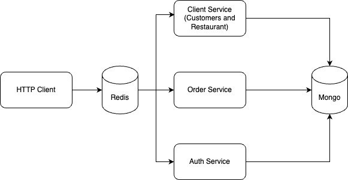
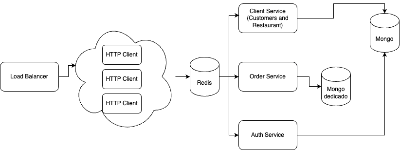
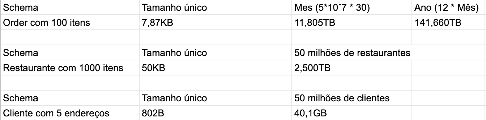

# Ifood Example Api

Api simples de demonstração de uso do framework Nest com MongoDB.

## Para executar o projeto

O melhor jeito de executar o projeto é usando o docker-compose, para isso basta executar o comando abaixo:

```bash
docker compose up
```

Serão executados 6 containers (2 banco de dados e 4 serviços), então esteja com o computador preparado.

Caso não queira usar o docker ou não o possua instalado, é necessário ter node, mongodb e redis instalados na máquina. Cada serviço precisa ser executado e configurado individualmente através do node e variáveis de ambiente.

## Para testar os endpoints da aplicação

A aplicação possui vários endpoints que estão documentados em `<url>/api`, onde `url` é geralmente `localhost:3000` caso não tenha alterado a porta padrão.

Lá é descrito todos os endpoints e quase todos tem exemplos de objetos que podem ser enviados.

> Notas de uso:
> - Para fazer login é necessário criar um usuário primeiro
> - Para fazer login como restaurante é necessário criar um restaurante primeiro
> - Para fazer um pedido é necessário ter um restaurante e um usuário cadastrados
> - A maioria dos endpoints necessitam de autenticação, então é necessário fazer login primeiro
> - Sugiro que abra o Swagger em duas abas, uma para o cliente e outra para o restaurante, para facilitar o uso

## Explicando o desenvolvimento

A aplicação foi desenvolvida de forma que todas as queries de consulta possivelmente feitas tenham tudo que precisem, mantendo o objeto o menor possível.

- `User`:

```javascript
{
  email: string;
  password: string;
  role: UserRole(CUSTOMER | RESTAURANT);
  user_id: string;
}
```

- `Restaurant`:

```javascript
{
  name: string;
  email: string;
  phone: string;
  address: {
    street: String,
    number: String,
    city: String,
    state: String,
    country: String,
  };
  menu: [
    {
      name: String,
      price: Number,
      description: String,
    },
  ];
}
```

- Customer:

```javascript
{
  name: string;
  phone: string;
  addresses: [
    {
      street: String,
      number: String,
      city: String,
      state: String,
      country: String,
    },
  ];
}
```

- `Order`:

```javascript
{
  restaurant: {
    _id: string;
    name: string;
  },
  customer: {
    _id: string;
    name: string;
  },
  items: [
    {
      name: string;
      price: number;
      quantity: number;
    },
  ];
  total: number;
  status: OrderStatus(PENDING | ACCEPTED | CANCELED | COMPLETED);
}
```

Essas quatro estruturas possuem sim relacionamentos entre si, mas o "join" é evitado ao se fazer o embed de dados, fazendo com que a consulta seja mais rápida e simples.

## Análise de escalabilidade

### Arquitetura

Inicialmente foi construído uma aplicação monolítica, onde todos os serviços estavam em um único projeto, mas pensando no desafio passado troquei para uma arquitetura de microserviços, dando maior independência no projeto e possibilitando uma maior escalabilidade do mesmo.

Esta arquitetura é composta por 3 serviços, um cliente HTTP, um banco de dados e um transmissor de mensagens, como mostrado na imagem abaixo:

<div align="center">



</div>

Tal arquitetura permite que cada serviço seja escalado individualmente, por exemplo, caso o serviço de clientes HTTP esteja sobrecarregado, basta aumentar a quantidade de instâncias dele (através de loadbalancing com réplicas), sem afetar os outros serviços. Também é possível escalar o banco de dados ou fazer com que algum serviço tenha um banco de dados dedicado de forma mais desacoplada (isso também é possível numa aplicação monolítica usando nest, mas aumenta consideralvemente o acomplamento).

<div align="center">



</div>

### Banco de dados

Com os modelos apresentados e as hipóteses de requisições apresentadas é possível construir uma tabela do pior caso dos modelos interessantes, como mostrado abaixo:

<div align="center">



</div>

O resultado que mais chama a atenção é o valor de bytes necessários para armazenar os pedidos, passando a casa da centena de terabytes. Mas quando se lembra que são 50 milhões de usuários fazendo 30 pedidos de 100 itens por mês, percebe-se o quão pequeno é este número. Para se ter uma ideia um HD de 20TB está custando 3-4mil reais, e este conseguiria suportar um pouco mais de um mês de dados de 50 milhões de usuários.

É visto, portanto, que mesmo com uma quantidade absurda de dados, o banco de dados não terá problemas de performance, pois a quantidade de dados é pequena e o banco de dados é escalável.

## Possíveis melhorias

Devido ao pouco tempo que tive para dedicar ao projeto, não consegui fazer tudo que gostaria, então vou listar algumas melhorias que gostaria de ter feito:
- Adicionar load balancing para pelo menos o HTTP Client
- Melhorar validações
- Melhorar documentação
- Implementar caching utilizando redis

Há também a possibilidade de melhorar a arquitetura do banco de dados, com o uso de sharding do mongodb, mas isso é algo que estava fora dos planos desde o princípio.
